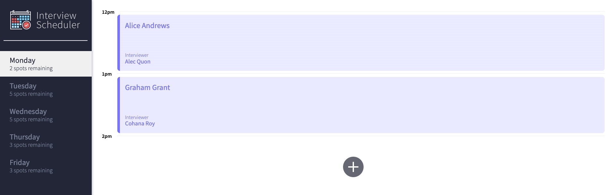
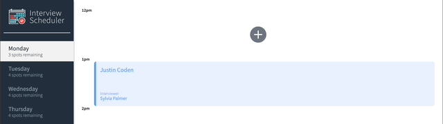
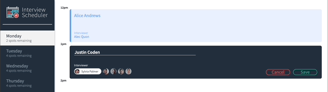
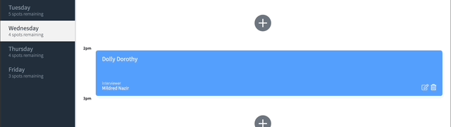

# Interview Scheduler

## About
Interview Scheduler is an app that lets the host organize and manage interviews in a more efficient manner. 

It lets users (interviewees) create, edit, and delete their schedule for interviews.

## Overview

The app displays the days from Monday to Friday, the spots remaining for that day, and the spot information for the selected day.

## Set up
- Clone the file by entering ```git clone git@github.com:kikopocampo/scheduler.git``` in your terminal.
- Go to the directory and enter ```npm install``` to install the required dependencies.
- Clone the API by entering ```git clone git@github.com:kikopocampo/scheduler-api.git``` in your terminal
- Follow the README file to set up the database
- Run both servers for the app and API by using ```npm start``` in your terminal
- Once that is set-up, go to http://localhost:8000 to go to the app

OR

- Visit https://639145fac8dba813a769664d--imaginative-cactus-6601c1.netlify.app/ to start using the app

## Usage
The app lets the user create an appointment by clicking on the + button which indicates that the spot is available for booking. It will then show a form that lets the user enter their name and select an interviewer of their choice.



Editing the form is also possible if the booking is already made. By pressing the "edit" button, the user will then be shown a form pre-filled with the current value of the appointment. After editing, hitting save will save the new values.


Wrong booking date? As with edit, it is also possible to cancel. Upon clicking the "delete" button, a confirmation portion will then be displayed to confirm the action to the user.



When an error occurs for any reason during the creation, edit, and deletion stage, an error message will be shown. Clicking X will return the user to the previous mode


## Dependencies
  - axios
  - classnames
  - normalize.css
  - react
  - react-dom
  - react-scripts
